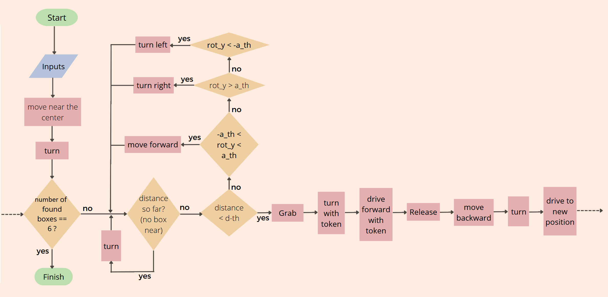

Research Track 1, First Assignment 
================================

In this assignment, we want to collect golden boxes one by one and gather them in one location (e.g. In the middle of the image in the gray square)
We use a portable robot simulator developed by [Student Robotics](https://studentrobotics.org).
Some of its arenas and the exercises have been modified for the Research Track I course

<p align="center">
    
    <br />
    <strong>Fig.1:</strong> First image of the robot and environment
</p>
<p align="center">
    
    <br />
    <strong>Fig.2:</strong> Final image of the robot and environment
</p>


> Flowchart of the program code

Installing and running
----------------------

The simulator requires a Python 2.7 installation, the [pygame](http://pygame.org/) library, [PyPyBox2D](https://pypi.python.org/pypi/pypybox2d/2.1-r331), and [PyYAML](https://pypi.python.org/pypi/PyYAML/).
Once the dependencies are installed, simply run the `test.py` script to test out the simulator.
We can also use operating system's package manager or Docker Desktop. 

## Exercise
-----------------------------

To run one or more scripts in the simulator, use `run.py`, passing it the file names. 

We can run the program with:

```bash
$ python run.py assignment.py
```

Robot API
---------

The API for controlling a simulated robot is designed to be as similar as possible to the [SR API][sr-api].

### Motors ###

The simulated robot has two motors configured for skid steering, connected to a two-output [Motor Board](https://studentrobotics.org/docs/kit/motor_board). The left motor is connected to output `0` and the right motor to output `1`.

The Motor Board API is identical to [that of the SR API](https://studentrobotics.org/docs/programming/sr/motors/), except that motor boards cannot be addressed by serial number. So, to turn on the spot at one quarter of full power, one might write the following:

```python
R.motors[0].m0.power = 25
R.motors[0].m1.power = -25
```

### The Grabber ###

The robot is equipped with a grabber, capable of picking up a token which is in front of the robot and within 0.4 metres of the robot's centre. To pick up a token, call the `R.grab` method:

```python
success = R.grab()
```

The `R.grab` function returns `True` if a token was successfully picked up, or `False` otherwise. If the robot is already holding a token, it will throw an `AlreadyHoldingSomethingException`.

To drop the token, call the `R.release` method.

Cable-tie flails are not implemented.

### Vision ###

To help the robot find tokens and navigate, each token has markers stuck to it, as does each wall. The `R.see` method returns a list of all the markers the robot can see, as `Marker` objects. The robot can only see markers which it is facing towards.

Each `Marker` object has the following attributes:

* `info`: a `MarkerInfo` object describing the marker itself. Has the following attributes:
  * `code`: the numeric code of the marker.
  * `marker_type`: the type of object the marker is attached to (either `MARKER_TOKEN_GOLD`, `MARKER_TOKEN_SILVER` or `MARKER_ARENA`).
  * `offset`: offset of the numeric code of the marker from the lowest numbered marker of its type. For example, token number 3 has the code 43, but offset 3.
  * `size`: the size that the marker would be in the real game, for compatibility with the SR API.
* `centre`: the location of the marker in polar coordinates, as a `PolarCoord` object. Has the following attributes:
  * `length`: the distance from the centre of the robot to the object (in metres).
  * `rot_y`: rotation about the Y axis in degrees.
* `dist`: an alias for `centre.length`
* `res`: the value of the `res` parameter of `R.see`, for compatibility with the SR API.
* `rot_y`: an alias for `centre.rot_y`
* `timestamp`: the time at which the marker was seen (when `R.see` was called).

For example, the following code lists all of the markers the robot can see:

```python
markers = R.see()
print "I can see", len(markers), "markers:"

for m in markers:
    if m.info.marker_type in (MARKER_TOKEN_GOLD, MARKER_TOKEN_SILVER):
        print " - Token {0} is {1} metres away".format( m.info.offset, m.dist )
    elif m.info.marker_type == MARKER_ARENA:
        print " - Arena marker {0} is {1} metres away".format( m.info.offset, m.dist )
```

Coding
----------------------
I wrote a simple code for this assignment and I used some few functions. 
At first, the program takes two parameters as thresholds. `a_th` and `d_th` are the angle and distance threshold which can help the robot know when it's close enough to the boxes(targets) so that it can grab them.
Parameter `box_finding` is set to True, so in the while loop, the robot searches to find the boxes, and whenever it finds the box, it exits the while loop. 
The defined functions for this assignment are as follows:

- drive
- turn
- find_token_gold()

The description of each function and then the main code is written further.

### drive ###

the drive(speed, seconds) function was created to allow the robot to move straight. It gets two inputs, `speed` and `seconds`. It will move with the power `speed` for a duration of `seconds`. it can go forward, with positive value of `speed`, or it can go backward with a negative value of `speed` parameter.
- `speed`: the linear velocity that we want the robot to assume. 
- `seconds`: the amount of seconds we want to drive.

```python
def drive(speed, seconds):

	R.motors[0].m0.power = speed
	R.motors[0].m1.power = speed
	time.sleep(seconds)
	R.motors[0].m0.power = 0
	R.motors[0].m1.power = 0
```

### turn ###

The turn(speed, seconds) function was created to allow the robot to spin around itself. It also gets two inputs, `speed` and `seconds`. It will move with the power `speed` for a duration of `seconds`. But, the right and left motors have equal speeds but with different signs, so the robot will turn in this way. 

```python
def turn(speed, seconds):

    R.motors[0].m0.power = speed
    R.motors[0].m1.power = -speed
    time.sleep(seconds)
    R.motors[0].m0.power = 0
    R.motors[0].m1.power = 0
```

### find_token_gold ###

The function  `find_token_gold()` looks for the closest golden box and returns its distance `dist` and angle `rot_y`. In this function, the robot looks for golden boxes. If it doesn't find a golden box, the function returns `-1` as output for `dist` and `rot_y` parameters. The code is as follows:

```python
def find_token_gold():
   
    dist = 100
    for token in R.see():
        if token.dist < dist and token.info.marker_type == MARKER_TOKEN_GOLD:
            dist = token.dist
            rot_y = token.rot_y
    if dist == 100:
        return -1, -1
    else:
        return dist, rot_y
```

### main code ###

By these functions, we can now describe the main code which makes the robot grab the golden boxes and release them in a new location until it gathers all boxes at there. 
At first, the robot goes close to the center of the image. Then, as we have 6 boxes, we write a for loop to generate the robot do its tasks and after realocating all the boxes, it stops. 
In while loop, first we call the function `find_token_gold()` and assign the distance and angle to `dist` and `rot_y`.
In some cases, the robot may not see a golden box around (`dist = -1`). So, the robot keeps turning and searching until it finds a golden box. By using the given thresholds, the robot can move and reach the boxes.
The Description of the main code is as follows:

```python

drive(50,4)
turn(-10,1)

for box in range(6) :

    box_finding = True
    while box_finding:  # This loop will execute for each subsequent box
        dist, rot_y = find_token_gold()
    
        if dist == -1:
            print("I don't see any more tokens. All boxes are placed!")
            turn(+10, 1)
        elif dist < d_th:
            print("Found it!")
            R.grab()  # If we are close to the token, we grab it.
            print("Gotcha!")
            turn(20, 2.5)  # Adjust robot position for the next box placement
    	      drive(27,4.8)   
            R.release()  # Release the box
            drive(-20, 1.5)
            turn(-10, 3)
            drive(20, 2)
            box_finding = False  # Box placed, exit the loop
        elif -a_th <= rot_y <= a_th:  # If the robot is well aligned with the token, move forward
            print("Ah, here we are!.")
            drive(40, 0.5)
        elif rot_y < -a_th:  # If the robot is not well aligned with the token, move left
            print("Left a bit...")
            turn(-2, 0.5)
        elif rot_y > a_th:
            print("Right a bit...")
            turn(+2, 0.5)
```

[sr-api]: https://studentrobotics.org/docs/programming/sr/
